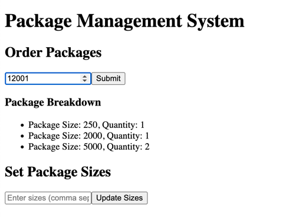

# OrderPacks
Repartners Software Engineer Challenge
# Start the backed app
Execute the following command in a terminal to start the app in a containerized environment
```
cd backend
make start
```
In a new terminal session run on of the following 2 requests:


1- To calculate the number of packs needed for a certain order use the following curl request, replacing order size with the needed size
```
curl localhost:8080/handleOrder/{orderSize}
```

2- To reset the package sizes use the following curl request, replacing the sizes array with the new sizes
```
curl http://localhost:8080/setPackageSizes \
    --include \
    --header "Content-Type: application/json" \
    --request "POST" \
    --data '{"sizes":[250,500,1000,2000,5000]}'
```


## To enable UI
run from the root of the project
```aiignore
docker compose build && docker compose up
```
